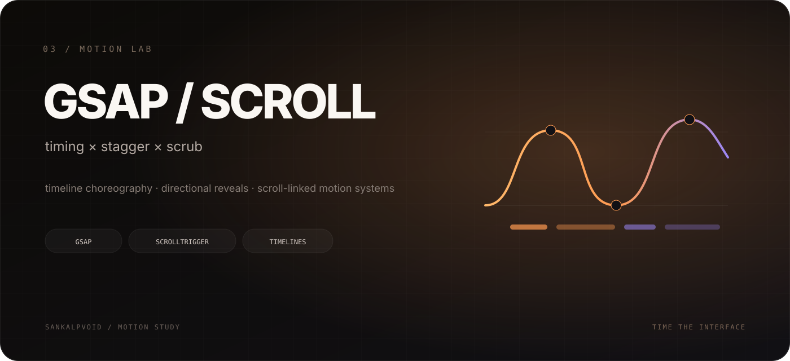

  

 

# GSAP Scroll Trigger

A motion-focused landing-page study built to understand sequencing, stagger, scrub and scroll-triggered choreography.

The project uses **GSAP timelines** for the opening sequence and **ScrollTrigger** for section-based animation. Navigation, hero content, brand marks and service cards enter with coordinated timing instead of isolated effects.

## What I explored

- timeline sequencing and stagger
- entrance choreography for hero content
- scroll-triggered motion
- scrubbed animation tied to scroll progress
- directional card reveals
- timing relationships between interface elements

## Working set

`HTML` · `CSS` · `JavaScript` · `GSAP` · `ScrollTrigger`

## Why this exists

This project was about treating animation as a **system of timing and hierarchy**, not decoration added after the interface was already built.

---

motion study / <a href="https://github.com/sankalpvoid">sankalpvoid</a>
